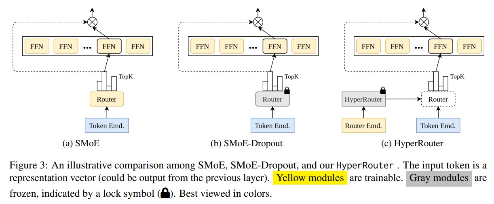

# HyperRouter: Towards Efficient Training and Inference of Sparse Mixture of Experts via HyperNetwork

[](https://opensource.org/licenses/MIT)

Code for this paper [HyperRouter: Towards Efficient Training and Inference of Sparse Mixture of Experts via HyperNetwork](https://openreview.net/forum?id=fL8AKDvELp)

Truong Giang Do, Le Huy Khiem, TrungTin Nguyen, Quang Pham, Binh T. Nguyen, Thanh-Nam Doan, Chenghao Liu Savitha Ramasamy, Xiaoli Li, Steven HOI

Our implementation is based on [fastmoe repo](https://github.com/laekov/fastmoe), [huggingface repo](https://github.com/huggingface/transformers) and [Smoe-Dropout repo](https://github.com/VITA-Group/Random-MoE-as-Dropout).


## Overview

By routing input tokens to only a few split experts, Sparse Mixture-of-Experts has enabled efficient training of large language models. Recent findings suggest that fixing the routers can achieve competitive performance by alleviating the collapsing problem, where all experts eventually learn similar representations. However, this strategy has two key limitations: (i) the policy derived from random routers might be sub-optimal, and (ii) it requires a substantial number of experts during evaluation, leading to limited efficiency gains during inference. This work introduces HyperRouter, which dynamically generates the router's parameters through a fixed hypernetwork and trainable embeddings. Consequently, HyperRouter achieves a balance between training the routers and freezing them to learn an improved routing policy. Extensive experiments across a wide range of tasks demonstrate the superior performance and efficiency gains of HyperRouter compared to existing routing methods. Our implementation will be made available upon acceptance.




## Prerequisite

- pytorch
- fastmoe: https://github.com/laekov/fastmoe
- transformer: https://github.com/huggingface/transformers

## Usage

##### Pretraining Transformer-XL on Enwik8 and Wikitext103: 

``` # Enwik8 dataset: 
bash script/table1/hyper_router_enwik8.sh
bash script/table1/smoe_dropout_enwik8.sh
bash script/table1/smoe_enwik8.sh
bash script/table1/directly_dense_dropout_enwik8.sh
bash script/table1/directly_dense_enwik8.sh
```


``` # Wikitext103 dataset: 
bash script/table1/hyper_router_wiki103.sh
bash script/table1/smoe_dropout_wiki103.sh
bash script/table1/smoe_wiki103.sh
bash script/table1/directly_dense_dropout_wiki103.sh
bash script/table1/directly_dense_wiki103.sh
```

##### Pretraining Transformer-XL on Medium and Large scale: 

``` # Medium Scale - Enwik8 dataset
bash script/LargeScale/hyper_router_medium_enwik8.sh
bash script/LargeScale/smoe_dropout_medium_enwik8.sh
bash script/LargeScale/smoe_medium_enwik8.sh
```

``` # Large Scale - Enwik8 dataset
bash script/LargeScale/hyper_router_large_enwik8.sh
bash script/LargeScale/smoe_dropout_large_enwik8.sh
bash script/LargeScale/smoe_medium_large.sh
```

##### Fine-tuning on SST-2:

```
bash script/table2/sst2/dense_model.sh [pretrained-checkpoint]
bash script/table2/sst2/smoe_dropout.sh [pretrained-checkpoint]
```


## Citation

```
@inproceedings{
  truong2023hyperrouter,
  title={HyperRouter: Towards Efficient Training and Inference of Sparse Mixture of Experts via HyperNetwork},
  author={Truong Giang Do and Le Huy Khiem and TrungTin Nguyen and Quang Pham and Binh T. Nguyen and Thanh-Nam Doan and Chenghao Liu and Savitha Ramasamy and Xiaoli Li and Steven HOI},
  booktitle={The 2023 Conference on Empirical Methods in Natural Language Processing },
  year={2023},
  url={https://openreview.net/forum?id=fL8AKDvELp}
}
```

